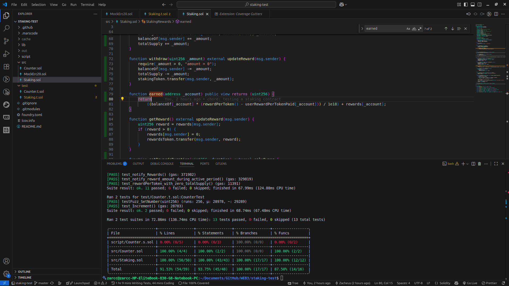

# Staking DApp

This project implements a simple staking rewards contract using Solidity and is tested with Foundry.

## The Staking Contract

The core logic is in `src/Staking.sol`. The `StakingRewards` contract allows users to stake a specific ERC20 token and earn rewards in another ERC20 token.

### Key Features:

*   **Staking:** Users can stake their tokens using the `stake(uint256 _amount)` function.
*   **Withdrawing:** Users can withdraw their staked tokens using the `withdraw(uint256 _amount)` function.
*   **Earning Rewards:** Rewards are calculated based on the staked amount and the duration of the stake.
*   **Claiming Rewards:** Users can claim their earned rewards using the `getReward()` function.

### For the Owner:

The contract owner has administrative privileges:

*   `setRewardsDuration(uint256 _duration)`: To set the duration over which rewards are distributed.
*   `notifyRewardAmount(uint256 _amount)`: To fund the contract with reward tokens and start the distribution.

## Testing

The project uses the [Foundry](https://book.getfoundry.sh/) framework for testing. The tests are located in `test/Staking.t.sol`.

The tests cover the full functionality of the `StakingRewards` contract, including:

*   Staking and withdrawing funds.
*   Correct reward calculation.
*   Access control for owner-only functions.
*   Edge cases such as staking zero amounts or interacting with the contract when no rewards are available.

The tests make use of Foundry's cheatcodes like `vm.prank` to simulate calls from different users, `vm.warp` to manipulate block timestamps for testing time-dependent logic, and `deal` to give accounts tokens.

## Test Coverage

